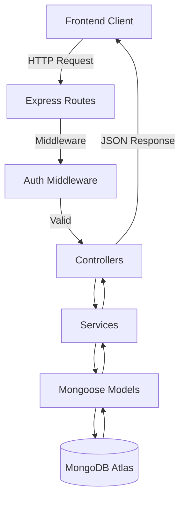

# Architecture Documentation

## 1. Backend Architecture

The backbone architecture is on **Node.js** with **Express.js** and strictly follows a **Controller-Service-Model** pattern for maintainability and separation of concerns.

### Key Implementation Details
- **Authentication**: This was built using **JWT (JSON Web Tokens)**, which is stored inside **HTTP-only cookies** for security.
    - `authMiddleware.js`: This intercepts requests to protected routes, verifies the token, and then attaches the user to the `req` object.
    - `authController.js`: Handles login/register, setting cookies with appropriate security flags (`httpOnly`, `secure`, `sameSite`).
- **Database Layer**: Uses **Mongoose** to interact with **MongoDB Atlas**.
    - **Schemas**: Strictly typed Mongoose schemas (`transactionsSchema.js`, `userSchema.js`).
    - **Indexing**: Performance optimized, including **Text Indexes** for search functionality.
- **Service Layer Pattern**: Business logic is strictly isolated in `services/`.
    - *Example*: `buildFilter.js` contains purely logic for translating query parameters into MongoDB operators (`$in`, `$regex`, `$gte`), keeping controllers clean.
- **Error Handling**: Centralized error handling ensures the same JSON error responses from the API via the `errorMiddleware.js`.

### Module Responsibilities

- **Controllers** (`src/controllers`): Incoming HTTP request handlers which include parsing of parameters and delegating to services.
- **Services** (`src/services`): Reusable Core business logic (i.e., auth logic, complex query building).
- **Models** (`src/models`): Mongoose data definitions and DB interaction.
- **Routes** (`src/routes`): Express routers which map endpoints (e.g. `/api/transactions`) to controllers.
- **Utils** (`src/utils`): Shared helpers like password hashing (`bcrypt`), validation, and async wrappers.

### Architecture Diagram


---

## 2. Frontend Architecture

Frontend is a **React.js** SPA initialized with **Vite**, offering fast HMR and optimized builds. Uniform styling has been taken care of using **TailwindCSS**.

### Key Implementation Details
- **Component Design**: The design is meant to be a modular one in which there are Layouts, Pages (Views), and Reusable Components (`src/components`).
    - *Atomic Design Principles*: Small, focused components (e.g., `SummaryCards`) are composed into larger views (`Dashboard`).
- **State Management**:
    - **Global State**: `AuthContext` (`useAuth.jsx`) manages user session capability across the app.
    - **Local State**: Component-level state (`useState`) handles ephemeral data like form inputs and active filters.
- **Routing**: Client-side routing through **React Router DOM**.
- **API Integration**: This will use services for centralized API configuration.
    - **Axios Interceptors**: Presumably use for global config like `credentials: include` (for cookies) and base URLs.
    - **Separation**: API calls are wrapped in their own methods (for example, `login();`, `getTransactions()`) which decouple them from the UI.

### Module Responsibilities
- **Components** (`src/components`):
    - **Auth**: Login/Register forms with validation.
    - **Dashboard**: High-level view orchestrating the dashboard layout.
    - **Transactions**: Complex UI for tables, filtering, and pagination.
    - **Layout**: Persistent UI shells (Sidebar, Topbar).
- **Hooks** (`src/hooks`): Abstract context usage under custom hooks like `useAuth`.
- **Services** (`src/services`): HTTP client setup and endpoint definitions.
- **Styles** (`src/styles`): Tailwind entry point and custom CSS.

---

## 3. Data Flow

### Request Life Cycle: Fetching Transactions

1. **Frontend State Trigger**: 
    When the user changes a filter (e.g., selects "Cotton") or refreshes the page (`FiltersContext` updates `filters`' state), the `useTransactions` hook (in `src/hooks/`) recognizes the change through a `useEffect` hook.

2. **API Client Request**: 
    Within `useTransactions`, an API call is made with `api.get('/transactions', { params: ... })`. This is routed through the Axios instance defined in `src/services/api.js`:
        - `baseURL`: read from `.env` (i.e. `http://localhost:5000`).
        - `withCredentials: true`: ensures HttpOnly cookies (JWT) are included in the request.

3. **Subsequent Network Arrival at Backend**: 
    The request is received at the Express server level.
    Global Middleware is fired up: `cors` (allows origin), `cookieParser` (parses cookies).

4. **Route Handling**(`src/routes/transactionRoute.js`): 
    - Router matches `GET /transactions`. 
    - `authMiddleware`, if employed, checks the JWT token from cookie.
    - Request is sent forward to `listTransactionsController.js`.

5. **Controller Elaboration**: 
    - This is where `listTransactionsController` extracts query params from `req.query` (for example, `tags='Cotton'`, `page=1`).
    - It then calls the `getTransactions` service function.

6. **Service Logic**(`src/services/getTransaction.js`): 
    - **Building a Filter**: Calls `buildFilter(params)` to build a MongoDB query object.
        - *Example transform*: `tags='Cotton'` becomes `Product.tags: { $in: ['Cotton'] }`.
        - *Search Logic*: If `q` is present, constructs regex `$or` query for Name/Phone.
    - **Building Sort**: This calls `buildSort(params)` to determine sorting (e.g., `{ date: -1 }`).
    - **Pagination**: `skip` and `limit` are calculated based on `page`/`pageSize`.

7.  **Database Interaction**: 
    - Executes `Transaction.find(filter).sort(sort).skip(skip).limit(limit)`.
    - Runs `Transaction.countDocuments(filter)` in parallel for pagination total counts. 
    - The results are returned as primitive JavaScript objects (via `.lean()`).

8.  **Response Formation**: 
    - The service returns a structured object: `{ meta: { page, totalItems, ... }, data: [...] }`.
    - Controller sends this object back as a 200 JSON response. 

9.  **Frontend Reception & Render**: 
    - The json response is received by axios.
    - The `useTransactions` hook sets the local state `data`.
    - `TransactionsView.jsx` detects the change in data and refreshes the `TransactionTable` along with the new rows.

---

## 4. Folder Structure

### Backend (`/Backend`)
```
Backend/
├── .env
├── .gitignore
├── package-lock.json
├── package.json
└── src/
    ├── controllers/
    │   ├── authController.js
    │   ├── getFilterscontroller.js
    │   ├── getSummaryController.js
    │   ├── healthController.js
    │   └── listTransactionsController.js
    ├── models/
    │   ├── transactionsSchema.js
    │   └── userSchema.js
    ├── routes/
    │   ├── authRoute.js
    │   └── transactionRoute.js
    ├── services/
    │   ├── auth.js
    │   ├── buildFilter.js
    │   ├── buildSort.js
    │   ├── getFilterMetadata.js
    │   ├── getSummary.js
    │   ├── getTransaction.js
    │   ├── importCsv.js
    │   └── validation.js
    ├── utils/
    │   ├── asyncHandler.js
    │   ├── authMiddleware.js
    │   ├── connectDB.js
    │   ├── errorMiddleware.js
    │   ├── normalizeCSV.js
    │   ├── password.js
    │   └── validator.js
    └── index.js
```

### Frontend (`/Frontend`)
```
Frontend/
├── .env
├── .gitignore
├── index.html
├── package-lock.json
├── package.json
├── vite.config.js
└── src/
    ├── components/
    │   ├── Auth/
    │   │   ├── Login.jsx
    │   │   └── Register.jsx
    │   ├── Dashboard/
    │   │   └── Dashboard.jsx
    │   ├── Layout/
    │   │   ├── Topbar.jsx
    │   │   ├── Layout.jsx
    │   │   └── Sidebar.jsx
    │   └── Transactions/
    │       ├── FilterPanel.jsx
    │       ├── Pagination.jsx
    │       ├── SummaryCards.jsx
    │       ├── TransactionTable.jsx
    │       └── TransactionsView.jsx
    ├── hooks/
    │   └── useAuth.jsx
    ├── routes/
    │   └── AppRoutes.jsx
    ├── services/
    │   ├── api.js
    │   └── auth.js
    ├── styles/
    │   └── index.css
    ├── utils/
    │   ├── FiltersContext.jsx
    │   └── formatters.jsx
    └── main.jsx
```
